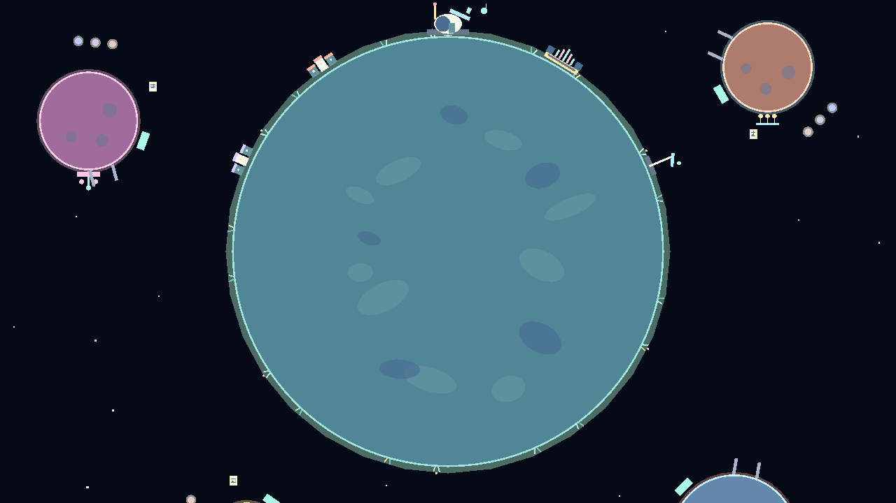

# Fly Me to the Moon — art starter kit

This folder gives the team a shared visual target without changing gravity, colliders, quest positions, or progression. The concept image is a direction reference. The small PNG files in `Sprites` are native-resolution starter assets that can be imported or replaced independently. `DemoArt` applies the same direction to the current full playable demo at runtime.

## Visual idea

The player is a tiny traveling musician exploring a colorful musical solar system. The world should feel hopeful, strange, and easy to read at game scale. Use chunky pixel clusters, strong silhouettes, and a restrained glow around musical objects. Avoid smooth vector edges, noisy single-pixel detail, and realistic space rendering.

Each moon has one landmark language:

| Moon theme | Landmark shapes | Accent |
|---|---|---|
| Crystal | Tall triangles and floating shards | Lavender |
| Volcanic | Broken rocks and thin hot cracks | Coral/orange |
| Ice | Pale shards and blue craters | Ice blue |
| Ruins | Arches, columns, and brass mechanisms | Gold |
| Garden | Flowers, vines, and round tree canopies | Pink |

These are decoration layers only. Parent them to any moon and rotate them to match the local surface, leaving the teammate-owned gravity bodies and colliders untouched.

The main planet deliberately uses a different density rule from the moons. Planet 612-B has an atmosphere, broad terrain patches, eighteen flora clusters, two villages, an observatory, a music stage, and an interplanetary beacon. Each moon has three terrain marks and one instrument landmark. This keeps the home world visually important while the moons remain readable during flight.

## Palette

| Name | Hex | Main use |
|---|---|---|
| Abyss | `#071426` | Background |
| Space blue | `#112849` | Visors and distant shapes |
| Shadow | `#243044` | Outlines and shaded surfaces |
| Deep teal | `#1F4C5B` | Home-planet shadow |
| Teal | `#2E8B7C` | Home-planet surface |
| Mint | `#72E5C2` | Friendly light and music feedback |
| Coral | `#F16F61` | Astronaut suit and volcanic light |
| Gold | `#FFD166` | Collectibles and important interactions |
| Lavender | `#B69CFF` | Crystal moon |
| Ice | `#79D7FF` | Ice moon and visor highlights |
| Blossom | `#F58FC6` | Garden moon |
| Paper | `#EAF2D7` | Score sheets and bright highlights |

Use Shadow for most outlines instead of pure black. Limit an individual sprite to four or five colors from this table.

## Unity import contract

The current camera is configured for 16 pixels per unit and a 320×180 reference resolution. Import the PNG files with:

- Texture Type: Sprite (2D and UI)
- Pixels Per Unit: 16
- Filter Mode: Point
- Compression: None
- Generate Mip Maps: Off
- Alpha Is Transparency: On

`astronaut_frame_1.png` through `astronaut_frame_4.png` are separate 24×24 sprites. `astronaut_starter_sheet.png` is a convenient strip for preview and later Aseprite work. The other files are single 16×16 sprites. Keep the current player collider and add the sprite under the player as a visual child so art changes cannot affect movement tests.

`ArtStarterImportSetup.Apply` applies these settings to every PNG in `Assets/Art/Sprites`. The committed `.meta` files already contain the result.

## Animation targets

- Astronaut idle: 2 frames at 2–3 fps
- Astronaut run: 4 frames at 8–10 fps
- Score fragment: alternate a one-pixel vertical offset and glow every 0.25 seconds
- Collection: 6–8 gold/mint particles plus one expanding ring
- Moon ambience: one subtle loop per biome, kept slower than player animation

## Safe integration order

1. Add the star/nebula background as a camera-following visual layer.
2. Add the astronaut sprite as a child of the current player prefab.
3. Replace only the visual children of the piano pickup; preserve `PianoPickup` and its trigger.
4. Place moon decoration prefabs as children of the moon transforms.
5. Reskin the collection UI after the world palette is approved.

The generator at `Tools/Art/generate_pixel_starter.py` recreates every native pixel asset deterministically. It requires Pillow and writes only inside `Assets/Art/Sprites`.
